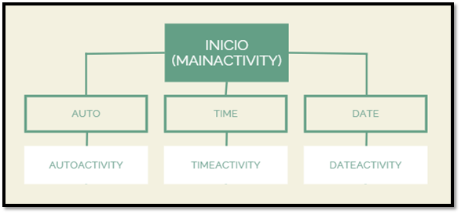
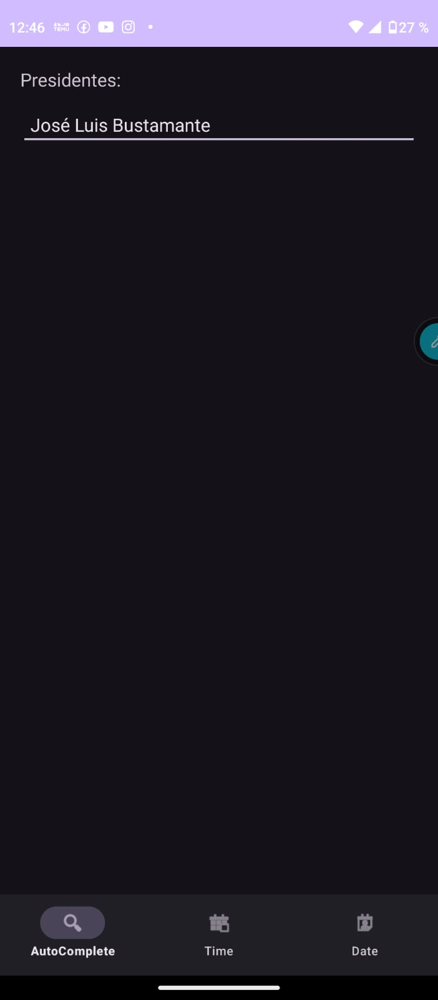
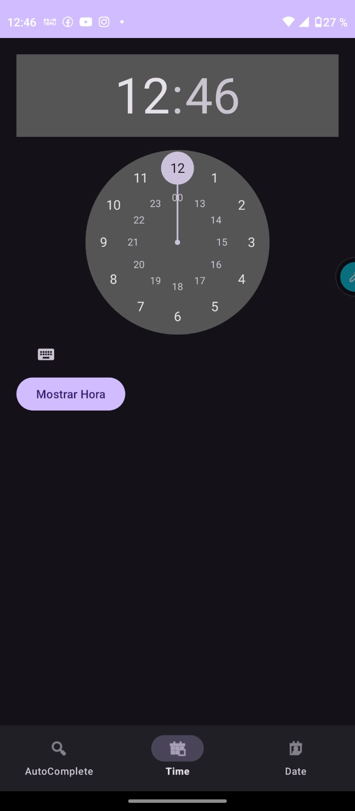
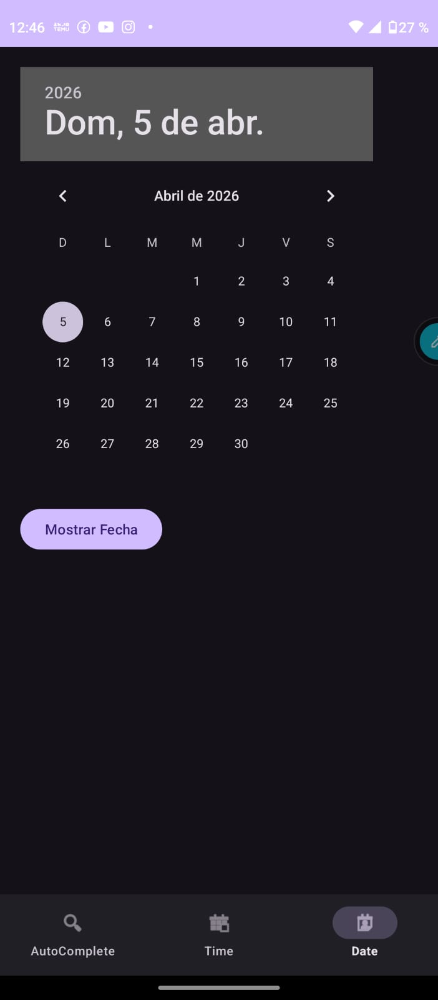

# Laboratorio 04 - Vistas en Android

Aplicación móvil desarrollada en **Android Studio con Kotlin**, que integra tres componentes principales de interacción:
**AutoCompleteTextView, TimePicker y DatePicker**, organizados en un solo proyecto mediante un **menú de navegación inferior (BottomNavigationView)**.

---

# 1. REQUISITOS

## Descripción

El sistema consiste en una aplicación móvil que permite al usuario interactuar con diferentes componentes de entrada de datos de Android.

## Requisitos funcionales

* Permitir al usuario ingresar texto con autocompletado.
* Permitir seleccionar una hora mediante **TimePicker**.
* Permitir seleccionar una fecha mediante **DatePicker**.
* Permitir la navegación entre funcionalidades mediante un menú inferior.

## Requisitos no funcionales

* Interfaz intuitiva y fácil de usar.
* Respuesta rápida del sistema.
* Compatibilidad con dispositivos Android.

---

# 2. DISEÑO

La aplicación fue diseñada utilizando múltiples actividades, cada una encargada de una funcionalidad específica.

Se implementó un **BottomNavigationView** para permitir la navegación entre las pantallas.

## Estructura de actividades

* **AutoActivity** → AutoCompleteTextView
* **TimeActivity** → TimePicker
* **DateActivity** → DatePicker

## Layouts utilizados

* LinearLayout
* RelativeLayout

---

# 3. MAPA DE NAVEGABILIDAD

```

```

La navegación se realiza mediante un menú inferior accesible desde todas las pantallas.

---

# 4. CONSTRUCCIÓN

La aplicación fue desarrollada en:

* **Lenguaje:** Kotlin
* **IDE:** Android Studio

## Tecnologías utilizadas

* AutoCompleteTextView
* TimePicker
* DatePicker
* BottomNavigationView
* ArrayAdapter
* Toast

## Funcionalidades implementadas

* Autocompletado dinámico de texto
* Selección de hora
* Selección de fecha
* Navegación entre actividades mediante intents

---

# 5. PRUEBAS

Se realizaron pruebas funcionales para validar el correcto funcionamiento:

* **AutoCompleteTextView:** muestra sugerencias después de 3 caracteres
* **TimePicker:** muestra correctamente la hora seleccionada
* **DatePicker:** permite seleccionar y visualizar la fecha
* **Navegación:** cambio correcto entre actividades

Todos los casos funcionaron correctamente.

---

# 6. CAPTURAS DE PANTALLA

## AutoCompleteTextView



## TimePicker



## DatePicker



---

# AUTOR

* Kimberly Barra Quispe

Este proyecto integra múltiples vistas en una sola aplicación, mejorando la experiencia del usuario mediante navegación intuitiva y componentes interactivos de Android.
